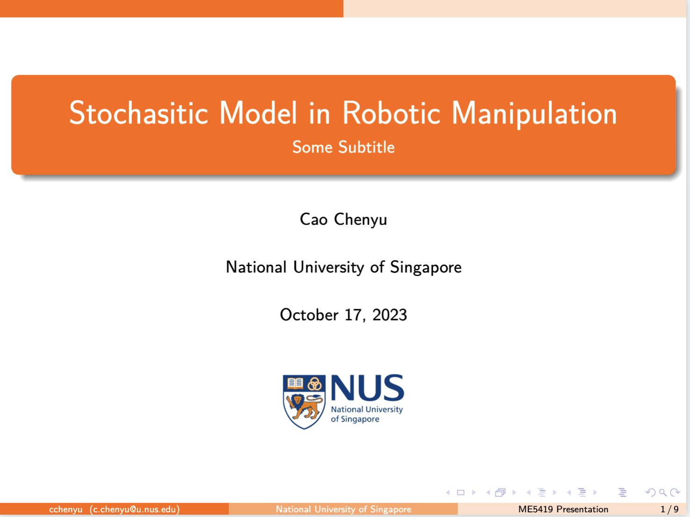
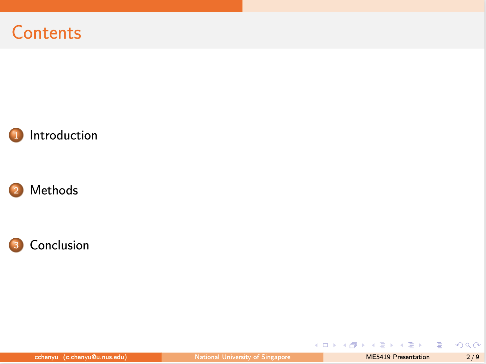
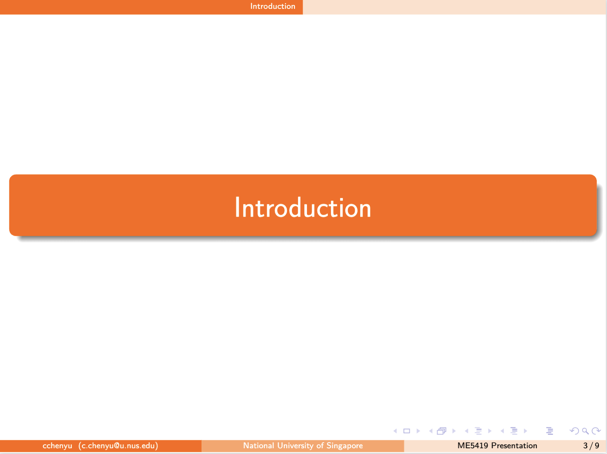
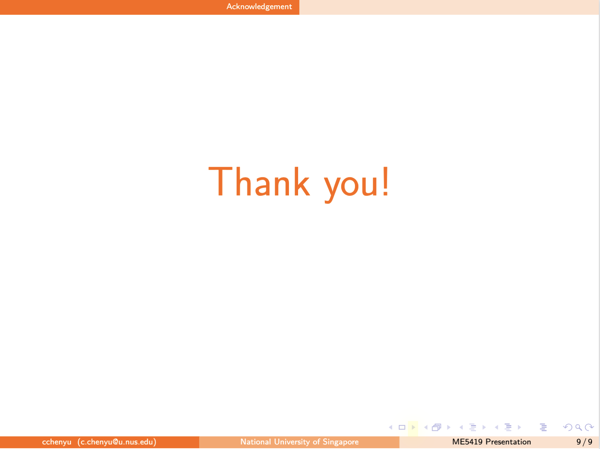
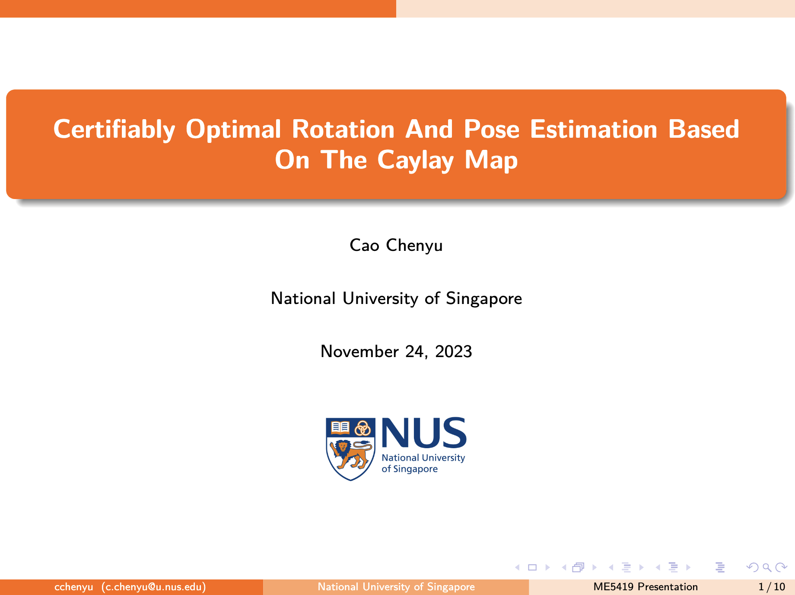
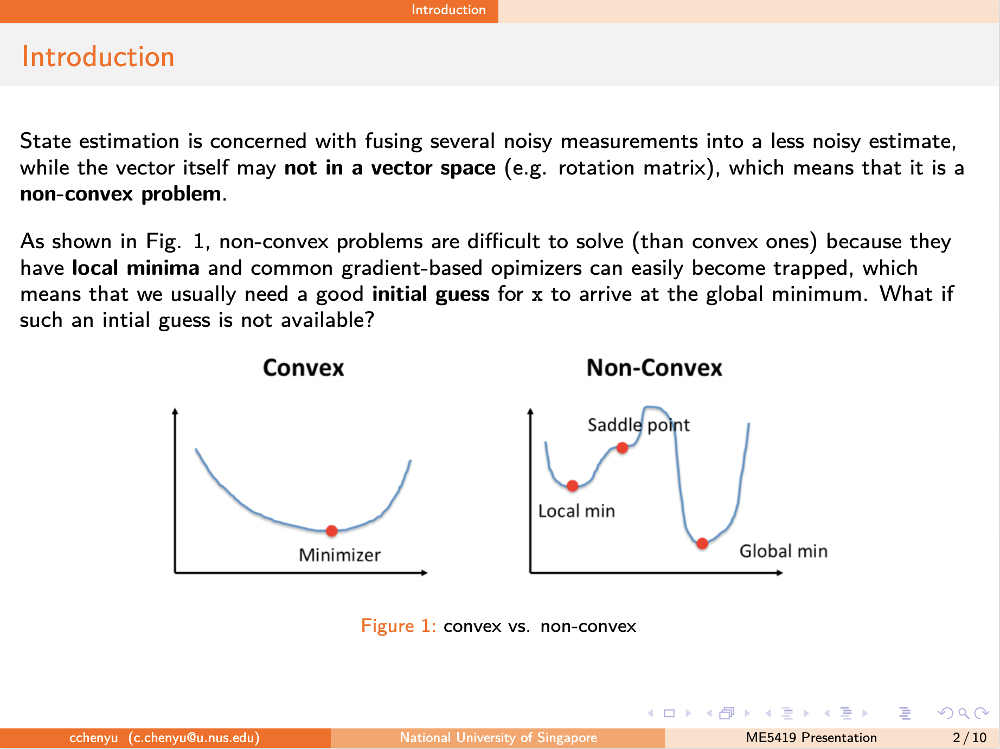
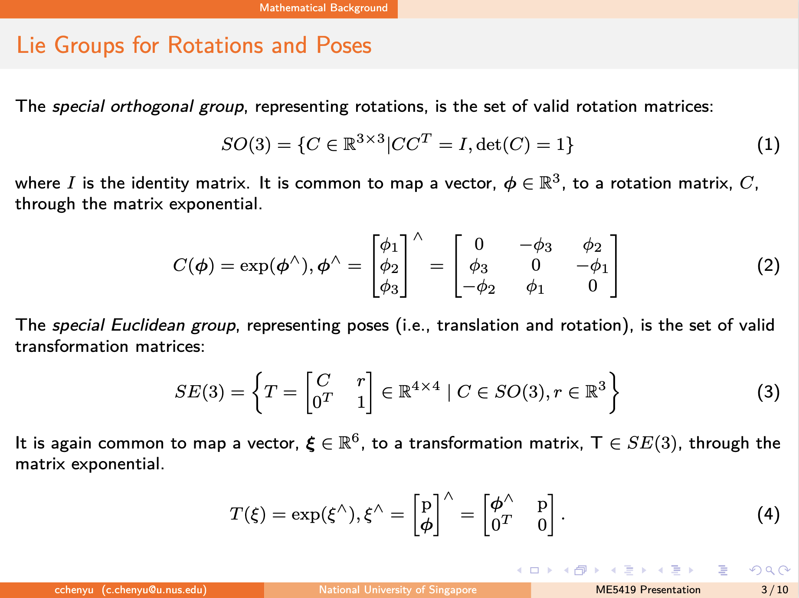
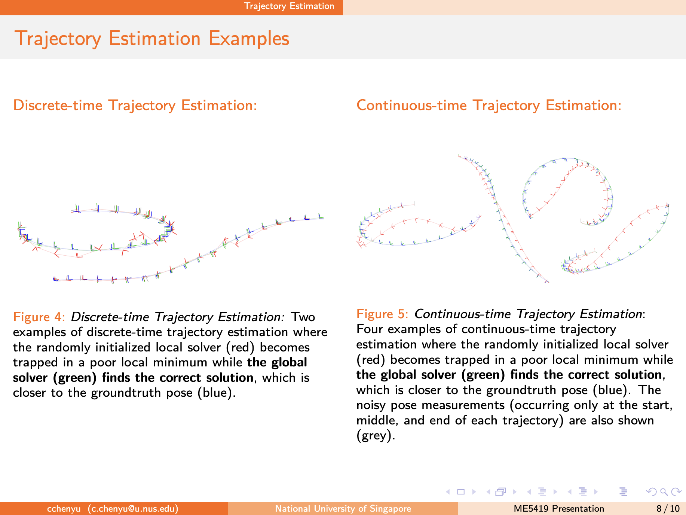

# NUS-Latex-Beamer

A simple NUS academic Latex Beamer template for faster and simpler presentation
> I referenced and made minor modifications to the beamer template from [CityU of Hong Kong Beamer Template](https://www.overleaf.com/latex/templates/cityu-of-hong-kong-beamer/kygnjxtcngtg).

|  |  |
|:---:|:---:|
|  |  |

## Example

It is a 5-min literature review example in the folder `example`, which shows a more complicated usage of Beamer.

You can download the `.zip` file and open it on OverLeaf for editing.

|  |  |
|:---:|:---:|
|  |  |
